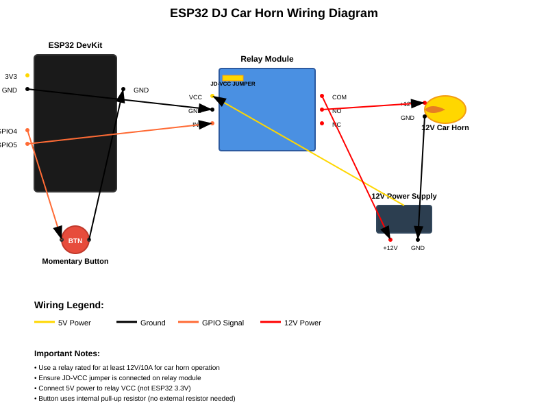

# ESP32 DJ Car Horn Sound Controller

Transform your regular car horn into the famous DJ car horn sound! This project uses an ESP32 microcontroller to create the classic "beep beep beep, beeeeeep" pattern that's instantly recognizable from DJ sets and electronic music.

## 🎵 Features

- **Authentic DJ Horn Sound**: Recreates the classic DJ car horn pattern with precise timing
- **Simple Operation**: Single momentary button activation
- **Safety Features**: Built-in button debouncing and cooldown period
- **Relay Control**: Safe 12V car horn operation through relay isolation
- **Debug Output**: Serial monitor feedback for troubleshooting

## 🛠️ Hardware Requirements

### Components List
- **ESP32 Development Board** (ESP32 DevKit or similar)
- **5V Relay Module** (capable of switching 12V/10A minimum)
- **Momentary Push Button** (normally open)
- **12V Car Horn** (standard automotive horn)
- **12V Power Supply** (adequate amperage for your horn)
- **Jumper Wires** for connections
- **Breadboard or PCB** (optional, for prototyping)

### Wiring Diagram



### Pin Connections

| ESP32 Pin | Connection | Description |
|-----------|------------|-------------|
| GPIO 4 | Momentary Button | Button input (uses internal pull-up) |
| GPIO 5 | Relay IN1 | Relay control signal |
| GND | Relay GND & Button | Common ground |
| 5V* | Relay VCC | Power for relay (see note below) |

| Relay Terminal | Connection | Description |
|----------------|------------|-------------|
| VCC | 5V Power Supply | Logic power (with JD-VCC jumper) |
| GND | ESP32 GND | Common ground |
| IN1 | ESP32 GPIO 5 | Control signal |
| COM | 12V Power Supply (+) | Common terminal |
| NO | Car Horn (+) | Normally Open contact |
| Car Horn (-) | 12V Power Supply (-) | Horn ground connection |

**⚠️ CRITICAL: JD-VCC Jumper Must Be Connected!**
- Most relay modules have a **JD-VCC jumper** that must be connected
- This jumper connects the relay coil power to the logic power
- **Without this jumper, the relay will not switch!**
- Use 5V power to VCC, not 3.3V from ESP32

## 🔧 Installation & Setup

### Prerequisites
- [PlatformIO IDE](https://platformio.org/platformio-ide) installed in VS Code
- Or [PlatformIO CLI](https://docs.platformio.org/en/latest/core/installation.html)

### Software Installation

1. **Clone the Repository**
   ```bash
   git clone https://github.com/idget/ESP32_Relay_Horn_Sound.git
   cd ESP32_Relay_Horn_Sound
   ```

2. **Open in PlatformIO**
   - Open VS Code with PlatformIO extension
   - File → Open Folder → Select project directory
   - PlatformIO will automatically detect the project

3. **Build and Upload**
   ```bash
   # Using PlatformIO CLI
   pio run --target upload
   
   # Or use the PlatformIO IDE upload button
   ```

4. **Monitor Serial Output**
   ```bash
   pio device monitor
   # Or use the PlatformIO IDE serial monitor
   ```

### Hardware Assembly

1. **Safety First**: Ensure all power sources are disconnected during assembly

2. **ESP32 Connections**:
   - Connect GPIO 4 to one terminal of the momentary button
   - Connect the other button terminal to ESP32 GND
   - Connect GPIO 5 to relay IN1 pin
   - Connect ESP32 3.3V to relay VCC
   - Connect ESP32 GND to relay GND

3. **Relay Connections**:
   - Connect relay COM terminal to 12V power supply positive
   - Connect relay NO (Normally Open) to car horn positive terminal
   - Connect car horn negative terminal to 12V power supply negative

4. **Power Supply**:
   - Use a 12V power supply rated for your horn's current draw
   - Most car horns draw 4-8 amps
   - Ensure proper fusing for safety

## 🎮 Usage

1. **Power On**: Connect the 12V power supply and ESP32 USB power
2. **Activation**: Press and release the momentary button
3. **Sound Pattern**: The horn will play the DJ pattern automatically:
   - Short beep (150ms)
   - Pause (100ms) 
   - Short beep (150ms)
   - Pause (100ms)
   - Short beep (150ms)
   - Longer pause (200ms)
   - Long beep (800ms)
4. **Cooldown**: Wait 1 second before the next activation is possible

## ⚙️ Customization

### Adjusting the Sound Pattern

Edit the timing constants in `src/main.cpp`:

```cpp
const int SHORT_BEEP = 150;     // Duration of short beeps (ms)
const int LONG_BEEP = 800;      // Duration of long beep (ms)
const int BEEP_PAUSE = 100;     // Pause between beeps (ms)
const int PATTERN_PAUSE = 200;  // Pause before long beep (ms)
const int COOLDOWN = 1000;      // Cooldown after pattern (ms)
```

### Changing GPIO Pins

Update the pin definitions if needed:

```cpp
const int BUTTON_PIN = 4;    // Change button pin
const int RELAY_PIN = 5;     // Change relay control pin
```

## 🐛 Troubleshooting

### Most Common Issue: JD-VCC Jumper

**Symptom**: IN1 LED flashes but relay doesn't click/switch

**Solution**: 
1. **Check for JD-VCC jumper** on relay module (small plastic jumper)
2. **Ensure jumper is connected** between JD-VCC and VCC pins
3. **Use 5V power** to VCC pin (not 3.3V from ESP32)
4. **Connect ESP32 GND** to relay GND pin

### Other Common Issues

**Horn doesn't sound:**
- Check 12V power supply connections
- Verify relay is clicking (you should hear it)
- Test car horn directly with 12V to confirm it works
- Check relay ratings (must handle horn's current draw)

**Button not responding:**
- Verify button wiring and ESP32 connections
- Check serial monitor for button press detection
- Ensure button is normally-open type

**Erratic behavior:**
- Check for loose connections
- Verify power supply stability
- Ensure adequate current capacity for horn

**Relay not activating:**
- Check GPIO 5 connection to relay IN1
- Verify relay power (3.3V and GND)
- Test with multimeter: GPIO 5 should show 3.3V when active

### Debug Mode

Monitor the serial output at 115200 baud to see:
- System initialization messages
- Button press detection
- Horn activation/deactivation events
- Pattern completion notifications

## ⚠️ Safety Warnings

- **Electrical Safety**: Work with power disconnected when making connections
- **Relay Ratings**: Ensure relay can handle your horn's current requirements
- **Fusing**: Use appropriate fuses in the 12V circuit
- **Hearing Protection**: Car horns are loud! Use in appropriate environments
- **Legal Compliance**: Check local laws regarding horn modifications

## 📝 Technical Details

### Software Architecture
- **Non-blocking Design**: Uses millis() timing instead of delay()
- **State Machine**: Manages horn pattern progression
- **Debouncing**: 50ms debounce prevents false button triggers
- **Cooldown**: Prevents rapid-fire activation

### Power Consumption
- **ESP32**: ~80mA during operation
- **Relay**: ~20mA when inactive, ~70mA when active
- **Total Logic**: <150mA from 3.3V supply
- **Horn**: Varies by model (typically 4-8A at 12V)

## 🤝 Contributing

Contributions are welcome! Please feel free to submit pull requests or open issues for:
- Bug fixes
- Feature enhancements
- Documentation improvements
- Additional sound patterns

## 📄 License

This project is licensed under the MIT License - see the [LICENSE](LICENSE) file for details.

## 🎉 Acknowledgments

- Inspired by the classic DJ car horn sound used in electronic music
- Built for the maker community and car audio enthusiasts
- Thanks to the ESP32 and PlatformIO communities for excellent documentation

---

**Enjoy your DJ car horn! 🚗🎵**
